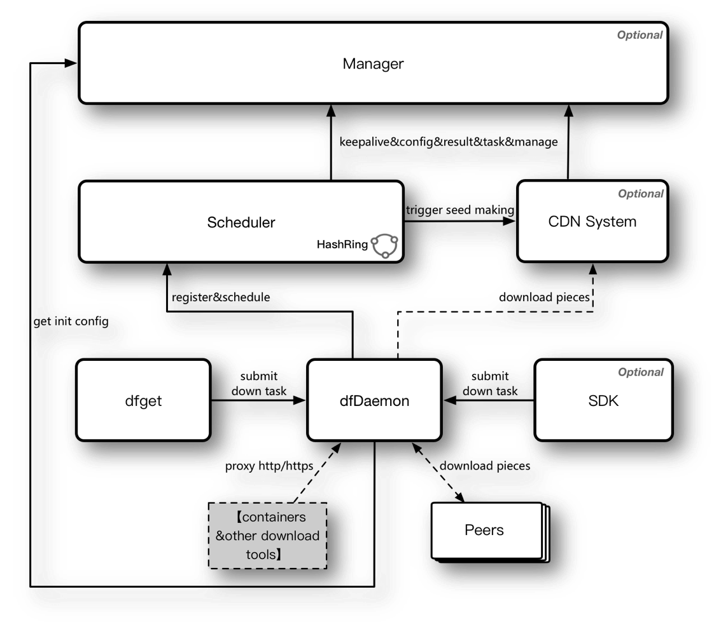

# Dragonfly

Provide efficient, stable, secure, low-cost file and image distribution services to be the best practice and standard solution in the related Cloud-Native area.

## Features

- Implement P2P files distribution with various storage types (HDFS, storage services from various cloud vendors, Maven, Yum, etc.) through a unified back-to-source adapter layer.
- Support more distribution modes: active pull, active push, real-time synchronization, remote replication, automatic warm-up, cross-cloud transmission, etc.
-  Provide separation and decoupling between systems, scheduling and plug-in CDN. Support on-demand deployment with flexible types: light or heavy, inside or outside, to meet the actual needs of different scenarios.
- Newly designed P2P protocol framework based on GRPC with improved efficiency and stability.
- Perform encrypted transmission, account-based transmission authentication and rate limit, and multi-tenant isolation mechanism.
- Bear more efficient IO methods: multithreaded IO, memory mapping, DMA, etc.
- Advocate dynamic compression, in-memory file systems, and more efficient scheduling algorithms to improve distribution efficiency.
- Client allows third-party software to natively integrate Dragonfly’s P2P capabilities through C/S mode.
- Productivity: Support file uploading, task management of various distribution modes, data visualization, global control, etc.
- Consistent internal and external versions, shared core features, and individual extensions of non-generic features.
- Enhanced integration with ecology: Harbor, Nydus (on-demand image download), warehouse services for various cloud vendors, etc.

## Architecture

**Manager:** Used to manage the dynamic configuration that each module depends on, and provide keepalive and metrics functions.
**Scheduler:** The tracker and scheduler in the P2P network that choose appropriate downloading net-path for each peer.
**CDN:** A CDN server that caches downloaded data from source to avoid downloading same files repeatedly.
**Daemon:** Used for pulling images only. It establishes a proxy between containerd/CRI-O and registry.
**Dfget:** The client of Dragonfly used for downloading files. It's similar to wget.

## Getting Started

- [Introduction][introduction]
- [Installation][installation]
- [Quick start][quickstart]

## Documentation
You can find the Dragonfly documentation [on the website][website].

## Community
Welcome developers to actively participate in community discussions and contribute code to Dragonfly. We will remain concerned about the issues discussed in the community and respond quickly.

- Discussions: [Github Discussion Forum][discussion]
- DingTalk: 23304666

## Contributing
You should check out our [CONTRIBUTING][contributing] and develop the project together.

## Code of Conduct
Please refer to our [Code of Conduct][codeconduct].

[contributing]: CONTRIBUTING.md
[codeconduct]: CODE_OF_CONDUCT.md
[introduction]: https://github.com/dragonflyoss/Dragonfly2
[installation]: https://github.com/dragonflyoss/Dragonfly2
[quickstart]: https://github.com/dragonflyoss/Dragonfly2
[website]: https://d7y.io
[discussion]: https://github.com/dragonflyoss/Dragonfly2/discussions
