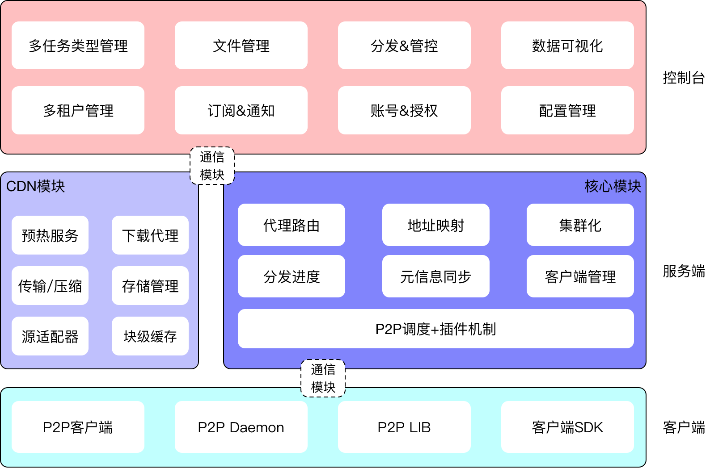
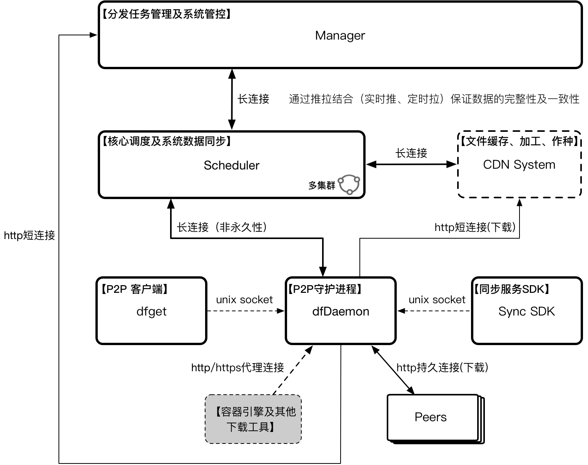

# Dragonfly2

## 产品定位
提供企业级（高效、稳定、安全、低成本、产品化）的文件分发与管理服务，并成为在该领域的云原生最佳实践与标准解决方案

## 解决的问题
1. 架构设计缺陷：现有架构很难满足日益增长的文件分发业务需要，在稳定性、效率以及安全性等方面逐渐暴露出不足，并受到越来越多的挑战
2. 价值渗透不足：当前只能支持HTTP回源协议，针对其他类型的存储（比如HDFS、各云厂商的存储服务、Maven、YUM等等）缺乏适配，从而导致覆盖的场景受到极大制约，进一步阻碍了其在公司和社区的推广以及价值传播
3. 分发模式单一：目前只支持主动拉取模式，缺少主动推送以及主动同步能力，而这些能力是满足我们产品定位的基本条件
4. 产品化能力缺失：没有提供完善的控制台功能，比如分发任务管理与管控、数据大盘、多租户以及权限控制等等
5. 内外版本不一致，维护成本高，新特性及问题修复难以短时间内同步

## 核心能力
+ 通过统一的回源适配层及实现支持各种不同类型存储（HDFS、各云厂商的存储服务、Maven、YUM等等）的P2P文件分发能力
+ 支持更多的分发模式：主动拉取、主动推送、实时同步、远程复制、自动预热、跨云传输等等
+ 系统之间分离解耦，调度与CDN插件化，且支持按需部署，可轻可重，可内可外，灵活满足不同场景的实际需要
+ 基于grpc全新设计的P2P协议框架，效率及稳定性更佳
+ 支持加密传输、基于账号的传输鉴权与限流、多租户隔离机制
+ 支持更高效的IO方式：多线程IO、内存映射、DMA等
+ 支持动态压缩、内存文件系统以及更高效的调度算法，提升分发效率
+ 客户端通过C/S模式支持第三方软件原生集成蜻蜓的P2P能力
+ 产品化能力：支持文件上传、各种分发模式的任务管理、数据视图以及全局管控等功能
+ 内外一套，核心特性相互共享，非通用特性各自扩展
+ 与生态进一步集成：Harbor、Nydus（镜像按需下载解决方案）、各云厂商仓库服务等

## 产品架构

## 技术架构

## 各子系统主要逻辑单元
Manager

+ 动态配置管理
+ 数据大盘&带宽计量
+ 文件上传&分发管理与管控
+ 文件同步管理
+ 账号&权限控制
+ 订阅&通知
+ 多租户管理
+ 命令通道服务（通道合一）

Scheduler

+ 基于多维度的P2P调度策略
+ 智能化调度算法（高级）
+ 调度结果可量化对比以及支持A/B Testing
+ 调度策略插件化以及CDN子系统插件化
+ 元信息下发管道
+ 客户端下载结果和回源结果统计以及与监控服务的对接

CdnSystem

+ 多源适配能力，包括目录下载和Range下载功能
+ DMA读写
+ 回源中转
+ 分发预热
+ 动态压缩
+ 存储管理（种子存放、磁盘清理、块级存储）
+ 内存文件系统
+ 安全传输（对称加密、完整性校验等）
+ 存储介质插件化

Client (dfdaemon、dfget)

+ 多源适配能力，包括目录下载和Range下载功能（和CDN一致）
+ 高效IO机制
+ 多下载任务的IO调度（高IO吞吐量）
+ 减少文件读写次数：改进临时文件存放方式、文件完整性校验改进
+ DMA读写（和CDN一致）
+ 流式传输
+ 客户端下载Proxy能力（http、https）
+ 单服务进程启动（CS模式）以及常驻和非常驻模式
+ 失败回源处理
+ 本地缓存能力（客户端seeder模式）
+ 客户端优雅升级与部署方案
+ 命令执行

Framework

+ 高可用、高性能、易集成
+ 一致性Hash算法选主
+ 客户端连接管理

## 最近半年任务计划

+ 一月：基本框架开发完成，主流程跑通
+ 二月：核心能力初步具备，同时支持客户端Proxy功能以及流式传输功能，Manager和CDN支持可插拔以及多源适配能力；release v2.0.0 alpha 版本
+ 三月：进一步改进性能和稳定性并引入相关高级特性支持，生产环境灰度上线；和Nydus、主流镜像仓库服务完成集成；release v2.0.0 beta版本
+ 四月：支持数据大盘以及带宽计量等数据化功能；release v2.0.0 正式版本
+ 五月：上海外滩大会PR；支持订阅通知、文件主动推送、远程拷贝、跨云传输等产品化能力
+ 六月：支持命令通道，完成通道合一；支持伪实时同步及多语言SDK支持；集团全量上线，完成内部版本和社区版本的最终合一

