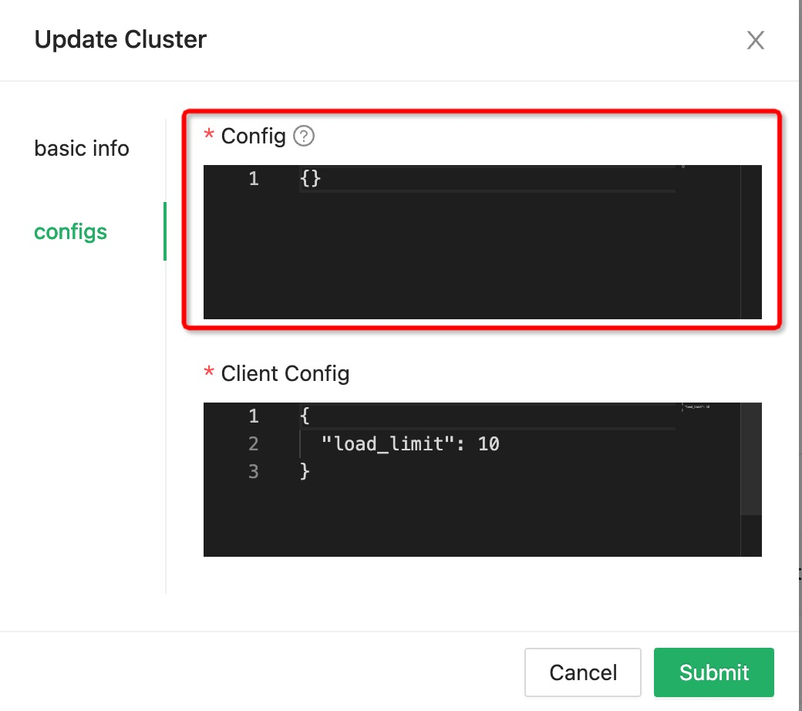
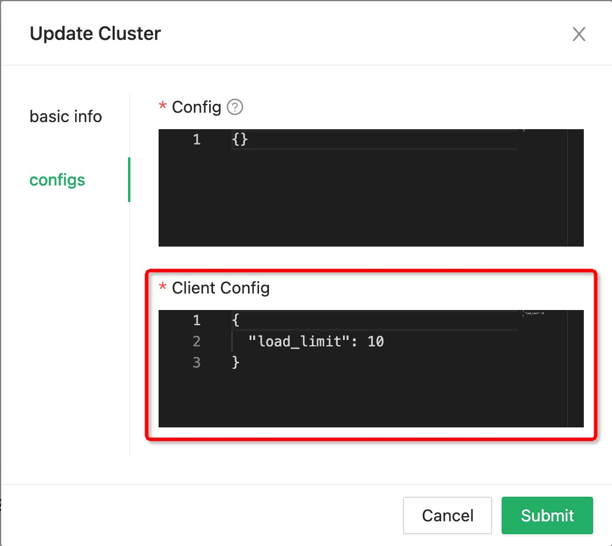
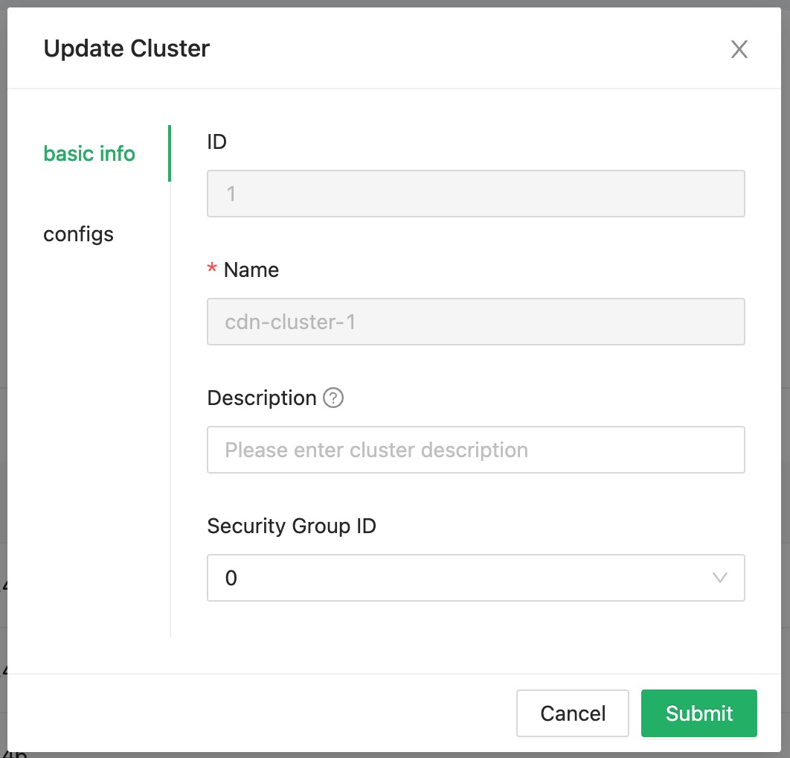

# Manager

Used to manage the dynamic configuration that each module depends on,
and provide keepalive and metrics functions.

## Relationship

- CDN cluster and Scheduler cluster have a `1:N` relationship
- CDN cluster and CDN instance have a `1:N` relationship
- Scheduler cluster and Scheduler instance have a `1:N` relationship

<!-- markdownlint-disable -->

  

<!-- markdownlint-restore -->

When the Scheduler instance starts,
it reports to the manager the Scheduler Cluster ID.
Refer to [document](../deployment/configuration/scheduler.yaml) to configure `schedulerClusterID`.

When the CDN instance starts,
it reports to the manager the CDN Cluster ID.
Refer to [document](../deployment/configuration/cdn.yaml) to configure `cdnClusterID`.

## User account

Default root username: `root` password: `dragonfly`.

## Pages

### User

#### Sign in

![signin][signin]

#### Sign up

![signup][signup]

### Configuration

#### Scheduler Cluster

##### Scheduler Cluster List

![scheduler-cluster][scheduler-cluster]

##### Add Scheduler Cluster

![add-scheduler-cluster][add-scheduler-cluster]

##### Configure Scheduler Cluster

<!-- markdownlint-disable -->

  

<!-- markdownlint-restore -->

##### Configure Scheduler Cluster's Client

<!-- markdownlint-disable -->

  

<!-- markdownlint-restore -->

- `load_limit`: client host can provide the maximum upload load.

#### CDN Cluster

##### CDN Cluster List

![cdn-cluster][cdn-cluster]

##### Add CDN Cluster

![add-cdn-cluster][add-cdn-cluster]

##### Configure CDN Cluster

<!-- markdownlint-disable -->

  

<!-- markdownlint-restore -->

- `load_limit`: CDN host can provide the maximum upload load.

[signin]: ../images/manager-console/signin.jpg
[signup]: ../images/manager-console/signup.jpg
[scheduler-cluster]: ../images/manager-console/scheduler-cluster.jpg
[add-scheduler-cluster]: ../images/manager-console/add-scheduler-cluster.jpg
[configure-scheduler-cluster]: ../images/manager-console/configure-scheduler-cluster.jpg
[configure-scheduler-cluster-client]: ../images/manager-console/configure-scheduler-cluster-client.jpg
[cdn-cluster]: ../images/manager-console/cdn-cluster.jpg
[add-cdn-cluster]: ../images/manager-console/add-cdn-cluster.jpg
[configure-cdn-cluster]: ../images/manager-console/configure-cdn-cluster.jpg
