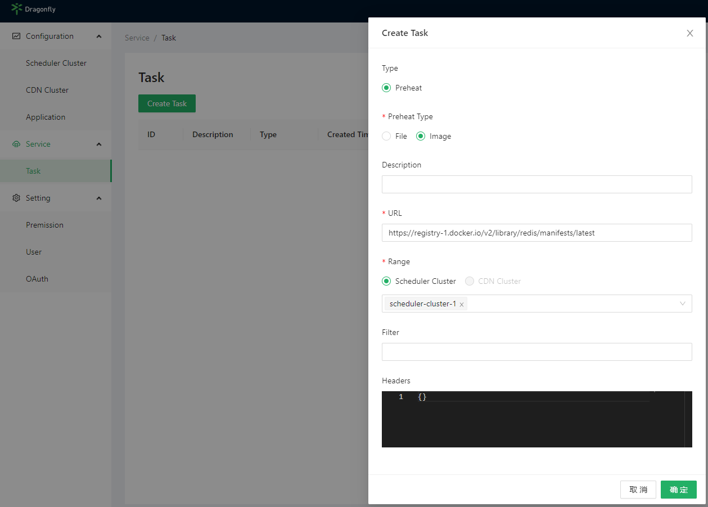
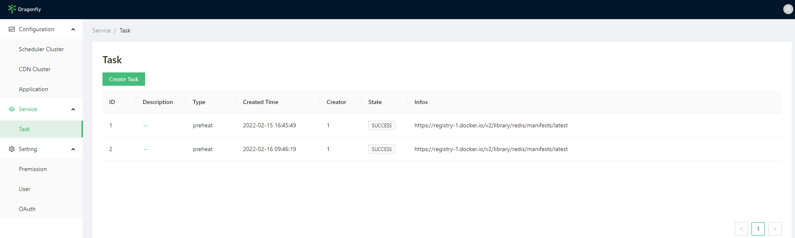
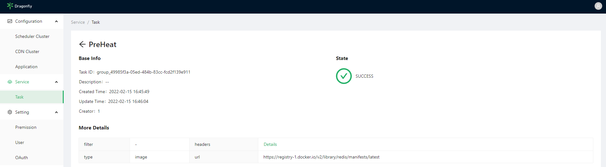

# console

Use preheat console for preheating.
First access Dragonfly Manager Console e.g. `http://dragonfly-manager:8080/service/task`
and create preheat task for preheating.

If the `scheduler_cluster_ids` does not selected, it means to preheat all scheduler clusters.



View preheat task list.



View preheat task details by Click `Description`.



## FAQ

### Create preheat task throw error

If create preheat task throw error,html alert `http error`,network response http status code is `500`,
Check whether Redis has write permission.

Dragonfly Manager error logs like:

```bash
2022-02-15T08:30:01.123Z ERROR job/preheat.go:159 create preheat group job failed
READONLY You  can't write against a read only replica.
d7y.io/dragonfly/v2/manager/job.(*preheat).createGroupJob
/go/src/d7y.io/dragonfly/v2/manager/job/preheat.go:159
d7y.io/dragonfly/v2/manager/job.(*preheat).CreatePreheat
/go/src/d7y.io/dragonfly/v2/manager/job/preheat.go:128
d7y.io/dragonfly/v2/manager/service.(*rest).CreatePreheatJob
/go/src/d7y.io/dragonfly/v2/manager/service/job.go:71
d7y.io/dragonfly/v2/manager/handlers.(*Handlers).CreateJob
/go/src/d7y.io/dragonfly/v2/manager/handlers/job.go:40
github.com/gin-gonic/gin.(*Context).Next
/go/pkg/mod/github.com/gin-gonic/gin@v1.7.7/context.go:168
d7y.io/dragonfly/v2/manager/middlewares.Error.func1
/go/src/d7y.io/dragonfly/v2/manager/middlewares/error.go:42
github.com/gin-gonic/gin.(*Context).Next
/go/pkg/mod/github.com/gin-gonic/gin@v1.7.7/context.go:168
github.com/gin-gonic/gin.CustomRecoveryWithWriter.func1
/go/pkg/mod/github.com/gin-gonic/gin@v1.7.7/recovery.go:99
github.com/gin-gonic/gin.(*Context).Next
/go/pkg/mod/github.com/gin-gonic/gin@v1.7.7/context.go:168
github.com/gin-gonic/gin.LoggerWithConfig.func1
/go/pkg/mod/github.com/gin-gonic/gin@v1.7.7/logger.go:241
github.com/gin-gonic/gin.(*Context).Next
/go/pkg/mod/github.com/gin-gonic/gin@v1.7.7/context.go:168
github.com/mcuadros/go-gin-prometheus.(*Prometheus).HandlerFunc.func1
/go/pkg/mod/github.com/mcuadros/go-gin-prometheus@v0.1.0/middleware.go:364
github.com/gin-gonic/gin.(*Context).Next
/go/pkg/mod/github.com/gin-gonic/gin@v1.7.7/context.go:168
github.com/gin-gonic/gin.(*Engine).handleHTTPRequest
/go/pkg/mod/github.com/gin-gonic/gin@v1.7.7/gin.go:555
github.com/gin-gonic/gin.(*Engine).ServeHTTP
/go/pkg/mod/github.com/gin-gonic/gin@v1.7.7/gin.go:511
net/http.serverHandler.ServeHTTP
/usr/local/go/src/net/http/server.go:2878
net/http.(*conn).serve
/usr/local/go/src/net/http/server.go:1929
```
