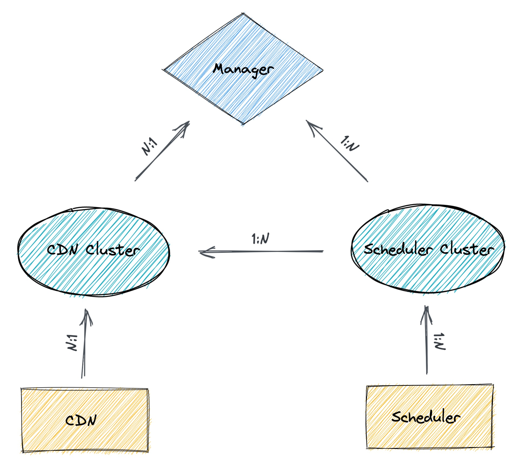

# Manager 控制台

Manager 控制台方便用户控制集群各模块服务，并且提供动态配置以及数据收集等功能。

## 关系模型

  

- CDN 集群与 Scheduler 集群为一对多关系
- CDN 集群与 CDN 实例是一对多关系
- Scheduler 集群与 Scheduler 实例是一对多关系

Scheduler 实例信息通过，配置文件启动实例上报指定 Scheduler 集群 ID。参考[文档配置](../../config/scheduler.yaml) `schedulerClusterID`。

CDN 实例信息通过，配置文件启动实例上报指定 CDN 集群 ID。参考[文档配置](../../config/cdn.yaml) `cdnClusterID`。

## 用户账号

服务启动后会默认生成 Root 用户, 账号为 `root`, 密码为 `dragonfly`。

## 功能页面

### 用户

#### 登陆

![signin][signin]

#### 注册

![signup][signup]

### Scheduler 集群

#### Scheduler 集群列表

![scheduler-cluster][scheduler-cluster]

#### 添加 Scheduler 集群

  

#### 配置 Scheduler 集群

![configure-scheduler-cluster][configure-scheduler-cluster]{ width: 200px; height: 200px; margin: 0 auto; display: block; }

#### 配置 Scheduler 集群覆盖的客户端

  

- `load_limit`: 客户端可以提供的最大下载任务负载数。

### CDN 集群

#### CDN 集群列表

![cdn-cluster][cdn-cluster]

#### 添加 CDN 集群

![add-cdn-cluster][add-cdn-cluster]

#### 配置 CDN 集群

![configure-cdn-cluster][configure-cdn-cluster]{ width: 200px; height: 200px; margin: 0 auto; display: block; }

  

- `load_limit`: CDN 可以提供的最大下载任务负载数。

[signin]: ../../../en/images/manager-console/signin.jpg
[signup]: ../../../en/images/manager-console/signup.jpg
[scheduler-cluster]: ../../../en/images/manager-console/scheduler-cluster.jpg
[add-scheduler-cluster]: ../../../en/images/manager-console/add-scheduler-cluster.jpg
[configure-scheduler-cluster]: ../../../en/images/manager-console/configure-scheduler-cluster.jpg
[configure-scheduler-cluster-client]: ../../../en/images/manager-console/configure-scheduler-cluster-client.jpg
[cdn-cluster]: ../../../en/images/manager-console/cdn-cluster.jpg
[add-cdn-cluster]: ../../../en/images/manager-console/add-cdn-cluster.jpg
[configure-cdn-cluster]: ../../../en/images/manager-console/configure-cdn-cluster.jpg
